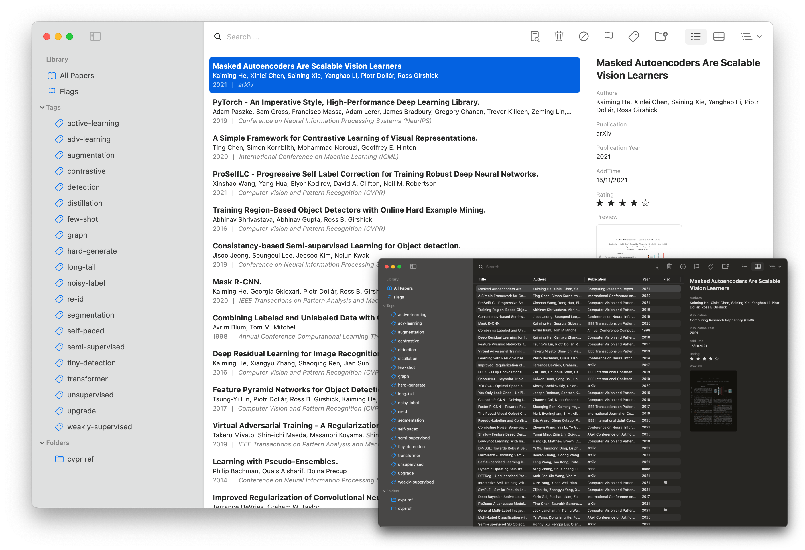

 

<h2><a href="https://paperlib.geoch.top/" > Paperlib </a></h2>
A simple academic paper management tool for CSer.

<a href="https://paperlib.geoch.top/en/download/" style="font-size: 16px"> » Download Here « </a>

---

## Highlights
- Scrape paper’s metadata from arXiv, doi.org, DBLP, IEEE and our online engine.
- Mark papers with multiple methods such as rating and flaging.
- Create tags and filter by tags. Create folders and filter by folders.
- Access your data from everywhere with a sync databsed supported by MongoDB atlas.
- Export papers to bibtex or plain text.

## Quick Start
[Introduction (EN)](https://paperlib.geoch.top/en/blog/intro/).  
[Introduction (CN)](https://paperlib.geoch.top/cn/blog/intro/)
## Donate

## License
[GPL-3.0 License](./LICENSE)
