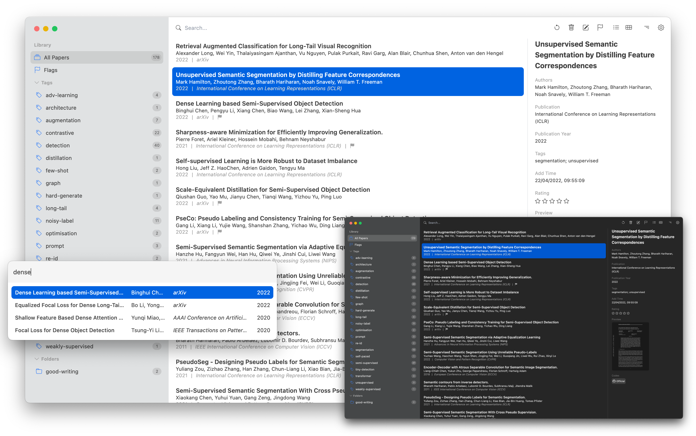

 

<h2><a href="https://paperlib.app/" > Paperlib </a></h2>
一个开源学术文献管理工具。

加入 <a href="https://discord.gg/4unrSRjcM9">Discord 社区</a>!

<a href='https://paperlib.app/en/'>官网</a> | <a href='https://paperlib.app/en/download.html'>下载</a> | <a href='https://paperlib.app/en/doc/getting-started.html'>开始指南</a> | <a href='https://github.com/users/Future-Scholars/projects/1/views/1'>开发路线</a>

---

📣 **我正在寻找合作伙伴来开发Paperlib。** 📣

如果你有兴趣，请联系我。

## 介绍

我是计算机科学的博士生。在我的研究领域，会议论文占据主要地位，这与其他学科有所不同。由于没有DOI、ISBN，很多会议论文的元数据很难查找（例如，NIPS、ICLR等）。当我在草稿论文中引用一篇出版物时，我需要一遍又一遍地在Google Scholar或DBLP上手动搜索它的出版信息。

**为什么不是Zotero、Mendeley？**

- 优秀的元数据抓取能力是论文管理工具的核心功能之一。不幸的是，世界上没有任何软件能很好地做到这一点，即使是商业软件也不行。
- 现代的用户界面。没有多余的无用功能。

我们可能需要的是：导入一篇论文，尽可能准确地抓取其元数据，简单地组织论文库，并在写论文时将其导出。

这就是Paperlib。

## 亮点

- 使用多个抓取器抓取论文的元数据。支持编写你自己的元数据抓取器。适用于多个学科。
- 全文和高级搜索。
- 智能过滤器。
- 评分、标记、标签、组和Markdown/纯文本笔记。
- 通过RSS订阅关注你研究主题的最新出版物。
- 从网上定位并下载PDF文件。
- 类似macOS Spotlight的插件，在写草稿论文时轻松复制粘贴引用。也支持MS Word。
- 云同步，支持macOS、Linux和Windows。
- 美观简洁的用户界面。
- 可扩展。你可以编写自己的扩展。

### 通过扩展，你可以：

- 显示引用次数。
- 使用LLMs总结论文。
- 使用LLMs自动标记论文。
- 使用自然语言语义搜索你的论文库，例如：“2024年由Geoffrey撰写的论文”。
- 与LLMs讨论你的论文。
- 以及更多...

## 下载和安装

<a href="https://paperlib.app/cn/download.html" style="font-size: 16px"> » 在此下载 « </a>

### Windows

⚠️ 你可能会注意到，在Windows上安装Paperlib时会出现警告。原因是Paperlib没有代码签名，因为这非常昂贵。Paperlib的源代码可以在这找到。它不会对你的电脑造成伤害，并且绝不会收集任何个人信息。请确保你使用HTTPS和我们的官方网站或Github下载安装程序。在安装`latest.exe`时，在“Windows保护你的电脑”窗口中，请点击“更多信息”并“仍要运行”。

### macOS

⚠️ 你可能需要点击`偏好设置` - `安全与隐私` - `仍要运行`。

### Linux

请参见[此处](https://paperlib.app/cn/download-linux.html)。

## 快速开始

[介绍（英文）](https://paperlib.app/en/doc/getting-started.html)  
[介绍（中文）](https://paperlib.app/cn/doc/getting-started.html)

## 捐赠

## 使用演示

### 抓取ICLR、ICML、NeurIPS等会议论文的元数据

### 与任何编辑器丝滑集成地写论文

### 使用LLM总结你的论文。使用LLM标记你的论文

### 使用标签、文件夹和智能过滤器组织你的图书馆

### 三种视图模式

## 赞助商

## 贡献Paperlib

### 扩展

请参考[链接](https://paperlib.app/cn/extension-doc/)了解开发文档。

### 新功能

我对任何新功能请求都持开放态度，我们可以在issue中讨论。

## 许可证

[GPL-3.0许可证](./LICENSE)